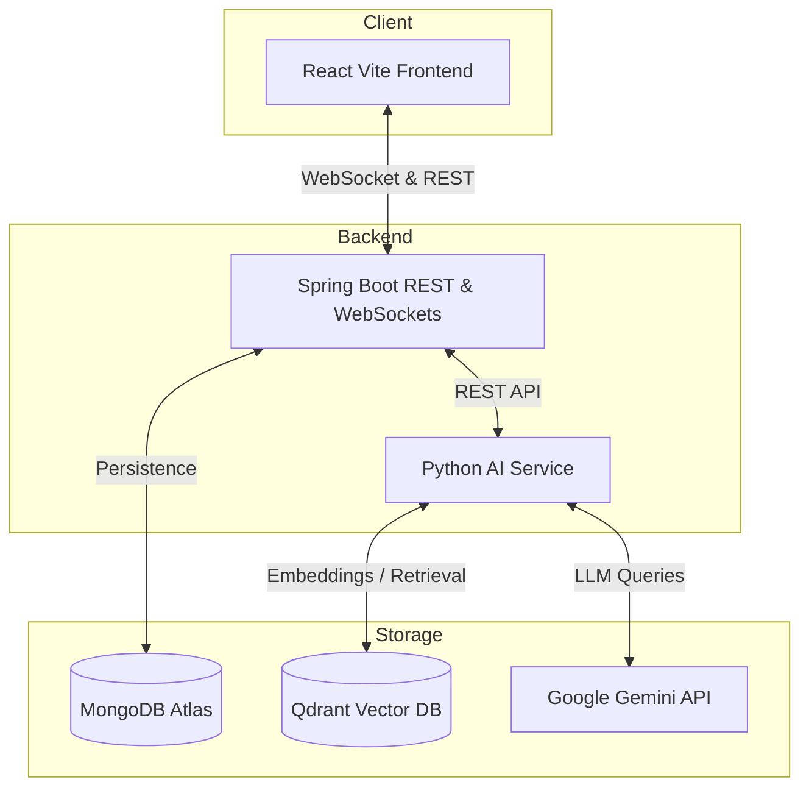

# Collabrix - Real-time AI Meeting Copilot & Memory Platform

Collabrix is a complete, enterprise-grade AI Meeting Intelligence Hub. It provides real-time WebRTC audio/video meetings, live speech-to-text transcription, automated meeting summarization, key highlights extraction, and an interactive **LangChain RAG-powered Meeting Memory Chatbot** to search past discussions.

---

## 🚀 Key Features

*   **Real-time HD Video & Audio:** Clean, Zoom-like WebRTC multi-peer conference rooms.
*   **Live Transcription:** Automatically transcribes speech to text in real-time.
*   **AI Summary & Action Items:** Generates smart summaries, action item assignments (with owners/deadlines), decisions, and risks using Google Gemini 1.5 Flash.
*   **AI Meeting Memory (RAG):** Uses LangChain and Qdrant to retrieve relevant excerpts and answer complex questions like *"What did we decide about the Stripe payment gateway?"*
*   **Persistent Meeting Intelligence:** Automatically saves summaries, transcripts, and action items in MongoDB so hosts can revisit past meetings.
*   **Containerized deployment:** Built-in multi-stage Dockerfiles and Docker Compose configuration.

---

## 🏗️ System Architecture



---

## 💻 Tech Stack

*   **Frontend:** React, TypeScript, Vite, WebRTC, HTML5 Media Stream, SCSS, Axios.
*   **Core Backend:** Spring Boot (Java 17), Spring Security, Spring WebSockets, Spring Data MongoDB.
*   **AI Service:** Python 3.10, Flask, LangChain (LCEL), Qdrant Python Client, Google Generative AI (Gemini 1.5 Flash & text-embedding-004).
*   **Databases:** MongoDB (Metadata & Transcripts), Qdrant (Vector Embeddings).

---

## 🛠️ How to Run Locally

### Option A: Docker Compose (Quickest & Easiest)

Ensure you have Docker Desktop running.

1.  Clone the repository and navigate to the project directory:
    ```bash
    git clone <your-repository-url>
    cd Collabrix
    ```
2.  Set your Gemini API Key in your shell env:
    *   **PowerShell:**
        ```powershell
        $env:GEMINI_API_KEY="your-gemini-key"
        ```
    *   **Linux/macOS:**
        ```bash
        export GEMINI_API_KEY="your-gemini-key"
        ```
3.  Build and run all services:
    ```bash
    docker-compose up --build -d
    ```
4.  Open **`http://localhost`** in your browser!

### Option B: Local Manual Running

1.  **Start Databases:**
    *   Start Qdrant container:
        ```bash
        docker run -d -p 6333:6333 -p 6033:6033 -v qdrant_storage:/qdrant/storage qdrant/qdrant:latest
        ```
    *   Ensure a MongoDB instance is running locally on port `27017` (Spring Boot defaults to embedded Mongo if not specified).

2.  **Start Python AI Service:**
    ```bash
    cd python-service
    pip install -r requirements.txt
    export GEMINI_API_KEY="your-gemini-key"
    python ai_service.py
    ```

3.  **Start Spring Boot Server:**
    ```bash
    cd note-server-spring
    ./mvnw spring-boot:run
    ```

4.  **Start React Frontend:**
    ```bash
    cd note-client
    npm install
    npm run dev
    ```
    *   Open **`http://localhost:5173`**.

---

## ☁️ Deployment Guide Summary

For production setup, you can deploy Collabrix to the cloud:
*   **Frontend:** Deploy to **Netlify** or **Vercel** (`dist/` directory).
*   **Spring Boot Backend:** Deploy to **Render** (Java environment, bind to `$PORT`).
*   **Python AI Service:** Deploy to **Render** (Python environment, use `gunicorn`).
*   **Vector DB:** Use **Qdrant Cloud** free tier.
*   **Database:** Use **MongoDB Atlas** free tier.

*For complete step-by-step instructions, see our [Deployment Guide](C:/Users/manik/.gemini/antigravity-ide/brain/e84d81d3-1b42-4e33-b229-852661a771c0/deployment_guide.md).*

---

## ⚙️ Environment Variables Config

| Service | Environment Variable | Recommended Value | Description |
| :--- | :--- | :--- | :--- |
| **Python** | `GEMINI_API_KEY` | `AIzaSy...` | Gemini API Auth Key |
| **Python** | `QDRANT_HOST` | `qdrant` / `localhost` | Qdrant host URL |
| **Spring Boot** | `PORT` | `8080` / Dynamic | Port assigned by the hosting provider |
| **Spring Boot** | `MONGODB_URI` | `mongodb+srv://...` | MongoDB database connection link |
| **Spring Boot** | `PYTHON_SERVICE_URL` | `http://ai-service:5000` | Address of Python AI endpoint |
| **React** | `VITE_API_URL` | `https://backend.onrender.com` | Production Spring Boot API URL |
| **React** | `VITE_WS_URL` | `ws://backend.onrender.com` | Production WebSockets endpoint |
